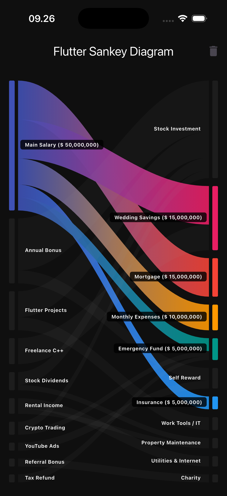

# Flutter Sankey Diagram

A custom implementation of a Sankey Diagram in Flutter using `CustomPainter`. This project demonstrates a performant way to visualize complex data flows with interactive node selection and smooth animations.

## Features

- **Interactive Selection**: Tapping on a node highlights its specific connected flows.
- **Automatic Layout**: Smart node height and gap calculation based on data values.
- **Reactive Data**: Handles dynamic data changes using `listEquals` for deep equality checks.
- **Custom Labels**: Flexible label rendering through a `labelBuilder` function.

## Preview



## How to Use

To use this component in your own project, follow these steps:

1. **Copy Source Files**: Copy all files located in the `lib/src` directory of this repository.
2. **Add to Your Project**: Paste the files into your project's `lib` folder (e.g., inside a `widgets/sankey` directory).
3. **Import and Implement**:
   Import the file and use the `SankeyDiagram` widget:

```dart
SankeyDiagram(
  leftNodes: leftNodes,
  rightNodes: rightNodes,
  labelBuilder: (context, node, isActive, isLeft, value) {
    return Text(
      node.label,
      style: TextStyle(
        color: isActive ? Colors.white : Colors.grey,
        fontWeight: FontWeight.bold,
      ),
    );
  },
)
```
